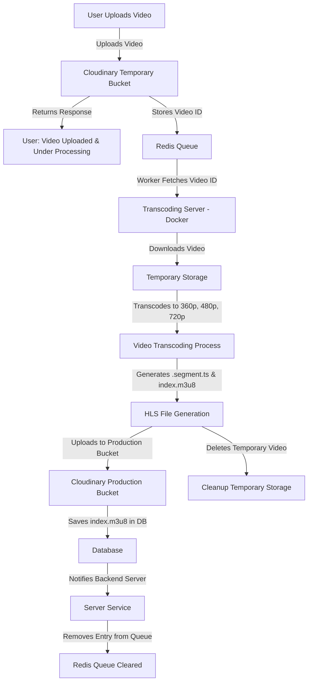

```mermaid
graph TD;
    A[User Uploads Video] -->|Uploads Video| B[Cloudinary Temporary Bucket];
    B -->|Returns Response| C[User: Video Uploaded & Under Processing];
    B -->|Stores Video ID| D[Redis Queue];

    D -->|Worker Fetches Video ID| E[Transcoding Server - Docker];
    E -->|Downloads Video| F[Temporary Storage];

    F -->|Transcodes to 360p, 480p, 720p| G[Video Transcoding Process];
    G -->|Generates .segment.ts & index.m3u8| H[HLS File Generation];

    H -->|Uploads to Production Bucket| I[Cloudinary Production Bucket];
    H -->|Deletes Temporary Video| J[Cleanup Temporary Storage];

    I -->|Saves index.m3u8 in DB| K[Database];
    K -->|Notifies Backend Server| L[Server Service];

    L -->|Removes Entry from Queue| M[Redis Queue Cleared];
```
